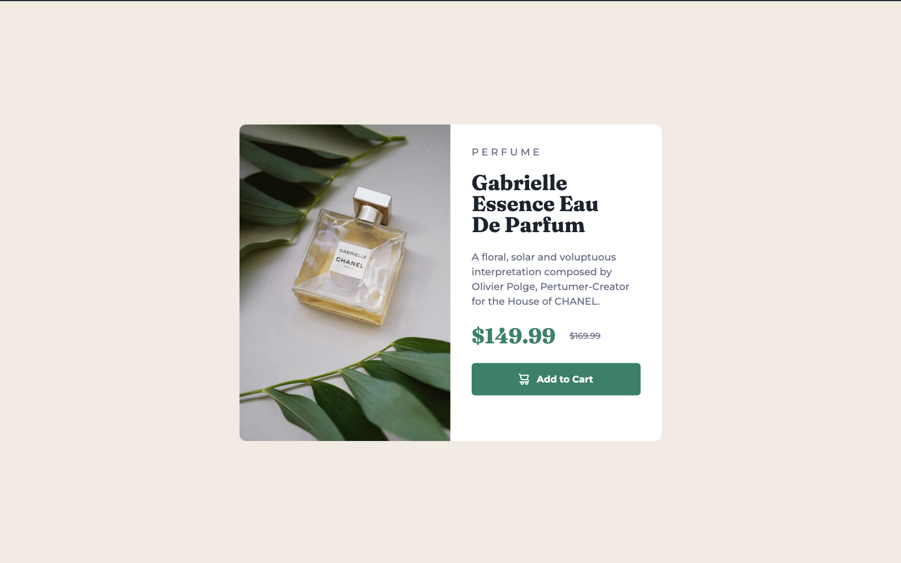
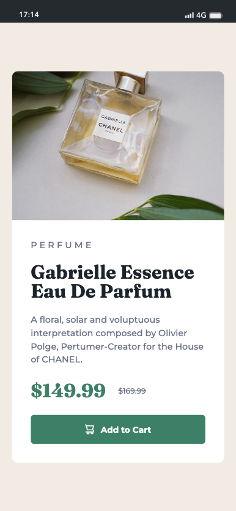

# Product Preview Card Component

Este é um projeto que resolve o desafio do [Product Preview Card Component no Frontend Mentor](https://www.frontendmentor.io/challenges/product-preview-card-component-GO7UmttRfa). Os desafios do Frontend Mentor ajudam a melhorar habilidades de codificação, construindo projetos realistas.

## Sumário

- [Visão geral](#visão-geral)
  - [O desafio](#o-desafio)
  - [Captura de tela](#captura-de-tela)
- [Meu processo](#meu-processo)
  - [Construído com](#construído-com)
  - [O que aprendi](#o-que-aprendi)

## Visão geral

### O desafio

Os usuários devem ser capazes de:

- Visualizar o layout ideal dependendo do tamanho da tela do dispositivo
- Ver estados de foco e hover para elementos interativos

### Captura de tela

 

## Meu processo

### Construído com

- Marcação HTML5 semântica
- Propriedades personalizadas de CSS 
- Flexbox
- Fluxo de trabalho mobile-first

### O que aprendi

- Aprendizado sobre Flexbox: 
  Aprendi como usar o Flexbox para criar layouts flexíveis e responsivos, permitindo que os elementos se ajustem de forma elegante em diferentes tamanhos de tela.

- Aplicação de CSS customizado: 
  Apliquei CSS personalizado usando variáveis para definir cores, fontes e outros estilos. Isso tornou o processo de estilização mais organizado e reutilizável.